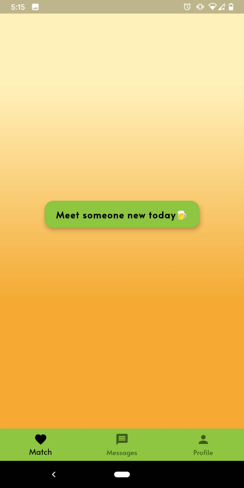

# Beer Garden 🌱
### Grow your relationships over a beer 🍻

###### This was created during our time as students at Code Chrysalis.

Beer Garden is a dating app with a twist ✨ It's an online beer garden where you can meet new people and make wonderful relationships *through conversations rather than by looks*!

Meet a new person everyday with both your photos blurred. As you build your new relationship through conversations, the photos will gradually reveal itself! 🎉

**Find true love ♥️ It all starts with a hearty** ***cheers!***🍻 

Available NOW at Google Play store 👉 [BeerGarden](https://play.google.com/store/)

### Here's a preview of the intro screen:


### This is a preview of the result screen:




## Installation

1. Please clone the repository.

2. Install packages

```bash
yarn install
yarn start
```

3.  Create a profile

4.  Get a match and chat away

5.  Find true love

## Contributing

Pull requests are welcome. For major changes, please open an issue first to discuss what you would like to change.


## Authors

👻  [Jeff Bentley](https://github.com/jbentleyjp)

😸  [Garrett Chun](https://github.com/Kapakahi)

🌝  [Yuya Harada](https://github.com/yuya-h-29)

🐸  [Riku Kawano](https://github.com/rikukawano)

🦄  [Yurika Namba](https://github.com/yurikanamba)

## License

[MIT](https://choosealicense.com/licenses/mit/)
