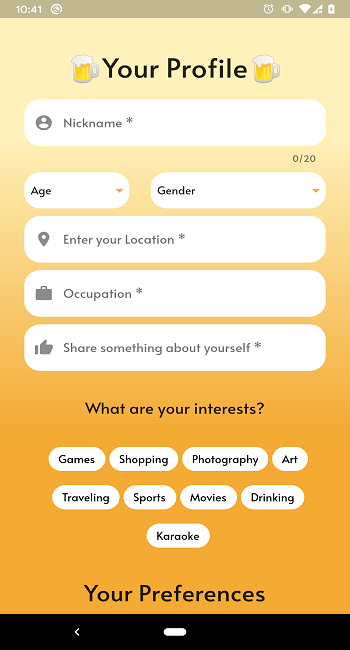

# Beer Garden 🌱
### Grow your relationships over a beer 🍻

###### This was created during our time as students at Code Chrysalis.

Beer Garden is a dating app with a twist ✨ It's an online beer garden where you can meet new people and make wonderful relationships *through conversations rather than by looks*!

Meet a new person everyday with both your photos blurred. As you build your new relationship through conversations, the photos will gradually reveal itself! 🎉

**Find true love ♥️ It all starts with a hearty** ***cheers!***🍻 

Available NOW at Google Play store 👉 [BeerGarden](https://play.google.com/store/)

### Here's a preview of the welcome screen:

### This is a preview of the create profile screen:

### This is a preview of the messages screen:

## Installation

1.  Go to Google Play and download the app

2.  Take a great selfie

3.  Create a profile

4.  Get a match and chat away

5.  Find true love

## Built With

- [Dart](https://dart.dev/)
- [Flutter](https://flutter.dev/)
- [Cloud Firestore](https://cloud.google.com/firestore)
- [Firebase](https://firebase.google.com/)

## Contributing

Pull requests are welcome. For major changes, please open an issue first to discuss what you would like to change.

## Authors

👻  Jeff Bentley - [![alt text][1.1]][1]       [![alt text][1.2]][2]

😸  Garrett Chun  -  [![alt text][1.1]][3]       [![alt text][1.2]][4]

🌝  Yuya Harada - [![alt text][1.1]][5]   [![alt text][1.2]][9]

🐸  Riku Kawano - [![alt text][1.1]][6]

🦄  Yurika Namba - [![alt text][1.1]][7]       [![alt text][1.2]][8]

[1.1]: http://i.imgur.com/9I6NRUm.png
[1.2]: ./images/twitter20.png
[1.5]: http://i.imgur.com/wWzX9uB.png

[1]: https://github.com/jbentleyjp
[2]: https://twitter.com/bentley449

[3]: https://github.com/KapakahiCoder
[4]: http://www.twitter.com/KapakahiCoder

[5]: https://github.com/yuya-h-29
[9]: https://twitter.com/harahara_29

[6]: https://github.com/rikukawano

[7]: https://github.com/yurikanamba
[8]: https://twitter.com/NambaYurika

## License

[MIT](https://choosealicense.com/licenses/mit/)
